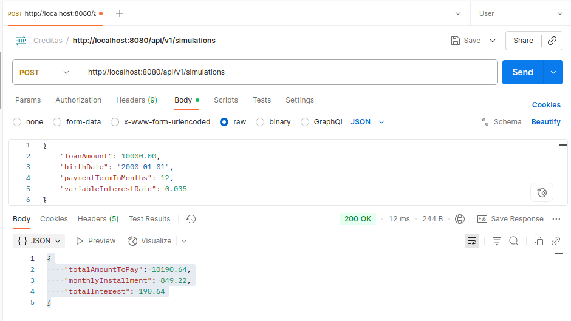

# 🚀 Simulador de Crédito – API Backend

## Descrição do Projeto
Aplicação backend de um **simulador de crédito**, que permite que os usuários possam simular empréstimos
e visualizar as condições de pagamento

---
# 🔧 Tecnologias Utilizadas
- **Linguagem:** Java 17
- **Framework:** Spring Boot 3
- **Gerenciamento de Dependências:** Maven
- **Documentação:** Swagger / OpenAPI
- **Testes:** JUnit 5, testes unitários
- **Docker:** Containerização da aplicação
- **Controle de Versão:** Git (GitHub)
- **IDE Recomendada:** IntelliJ IDEA
- **Boas Práticas:** Clean Code, SOLID, arquitetura em camadas
    - **Arquitetura em Camadas**: Separação clara entre responsabilidades — `controller` (exposição de endpoints), `service` (regras de negócio), `dto` (transferência de dados) e `exceptions/handlers` (tratamento de erros).
    - **Princípio da Responsabilidade Única (SRP)**: Cada classe possui uma função bem definida. Exemplo: `LoanSimulationService` concentra exclusivamente as regras de simulação.
    - **Extensibilidade das Regras de Negócio**: A lógica de cálculo de juros por faixa etária foi implementada de forma desacoplada, permitindo futura evolução (ex.: configuração em banco de dados sem alterar código).
    - **Testabilidade**: Serviços implementados isoladamente, facilitando testes unitários e de integração.
    - **Legibilidade e Clareza**: Nomes de variáveis e métodos refletem diretamente a regra de negócio, reduzindo necessidade de comentários adicionais.
    - **Precisão nos Cálculos Financeiros**: Uso de `BigDecimal` garante confiabilidade em operações envolvendo valores monetários.

# 📦 Funcionalidades

### Simulação de empréstimo:
- **Entrada:** valor do empréstimo, data de nascimento do cliente, prazo de pagamento em meses

### Cálculo de taxa de juros por faixa etária:
- Até 25 anos: 5% a.a
- 26 a 40 anos: 3% a.a
- 41 a 60 anos: 2% a.a
- Acima de 60 anos: 4% a.a

### Fórmula de parcelas fixas:
- PMT = (PV * r) / (1 - (1 + r)^(-n))
- Total Pago = PMT * n
- Juros Totais = Total Pago - P 

Onde:
  - PMT = valor da parcela mensal
  - PV = valor presente (valor do empréstimo)
  - r = taxa de juros mensal (taxa anual / 12)
  - n = número total de parcelas (meses)
  - P = valor do empréstimo

### Resultado da simulação:
- Valor total a pagar
- Valor das parcelas mensais
- Total de juros pagos


# 📄 Endpoint da API


# 🧪 Testes e Qualidade
- Testes unitários cobrindo regras de negócio e cálculos financeiros
- Validação de entrada e tratamento de erros

# ⚙️ Como Rodar
1. Compile e rode a aplicação:

#### 1️⃣ Rodando Localmente
```bash
mvn clean spring-boot:run
```

#### 2️⃣ Rodando via Docker
```bash
# Build da imagem
docker build -t credit-simulator .

# Rodar container
docker run -p 8080:8080 credit-simulator
```

2. Teste o endpoint via Postman ou Curl: 
**Endpoint:** `POST http://localhost:8080/api/v1/simulations`  
**Request Body:**

```json
{
  "loanAmount": 10000,
  "birthDate": "2000-09-01",
  "paymentTermInMonths": 12
}
```
**Response Esperado:**

```json
{
  "monthlyInstallment": 856.07,
  "totalInterest": 272.90,
  "totalAmountToPay": 10272.90
}
```
---
4. Acessar o Swagger:
   [http://localhost:8080/swagger-ui.html](http://localhost:8080/swagger-ui.html)
